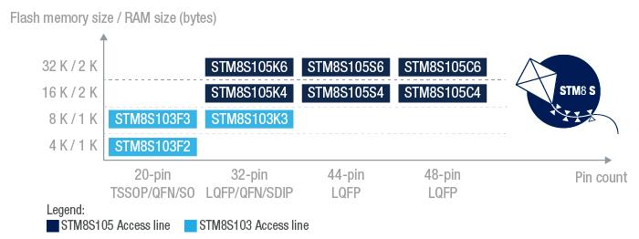
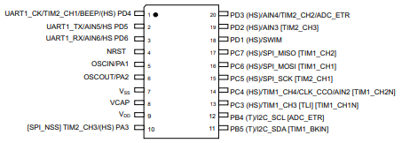
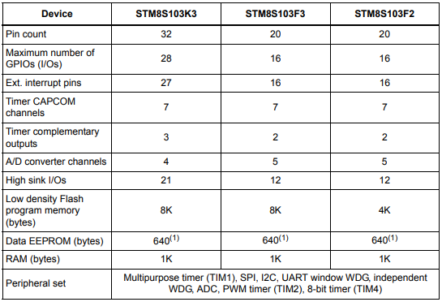

# [STM8S103](https://github.com/sochub/STM8S103)

 

#### [Vendor](https://github.com/sochub/Vendor)：[ST](https://github.com/sochub/ST)
#### [Core](https://github.com/sochub/STM8)：[STM8](https://github.com/sochub/STM8)
#### [Level](https://github.com/sochub/Level)：16MHz 

## [STM8S103描述](https://github.com/sochub/STM8S103/wiki) 

[STM8S103](https://github.com/sochub/STM8S103) 是[STM8S](https://github.com/sochub/STM8S)系列中高性价比产品，属于标准多功能8位微控制器。

它基于专有16 MHz内核，具有全套定时器、接口（UART、SPI、I2C）、10位ADC、内部和外部时钟控制系统、看门狗、自动唤醒单元和集成式单线调试模块。

[STM8S103](https://github.com/sochub/STM8S103)和[STM8S003](https://github.com/sochub/STM8S003)的主要区别是Flash的擦写次数和EEPROM的容量和读写次数

 

* TSSOP20封装

 

### [收录资源](https://github.com/sochub/STM8S003)

* [文档](docs/)
* [资源](src/)

#### [外部资源](https://github.com/sochub)

* [STM8CubeMX](https://www.st.com/zh/development-tools/stm8cubemx.html)
* [编译器SDCC](https://github.com/sochub/sdcc)
* [OS-Q H02](https://github.com/OS-Q/H02)

### [选型建议](https://github.com/sochub)

[STM8S103](https://github.com/sochub/STM8S103)一般用于开源硬件和工程验证，具有更可靠耐用的存储空间

* 量产方案[STM8S003](https://github.com/sochub/STM8S003) 
* 替换产品[N76E003](https://github.com/sochub/N76E003) 
* 升级产品[STM8S105](https://github.com/sochub/STM8S105) 

##  [SoC资源平台](http://www.qitas.cn)  

